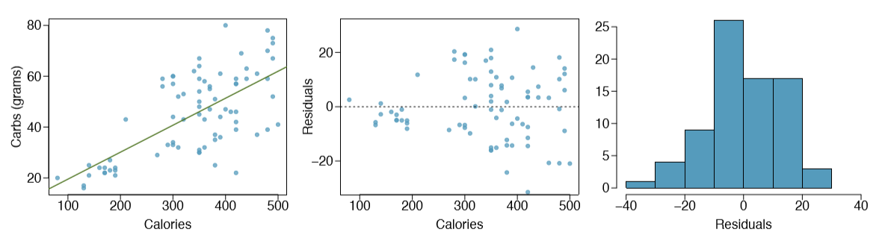
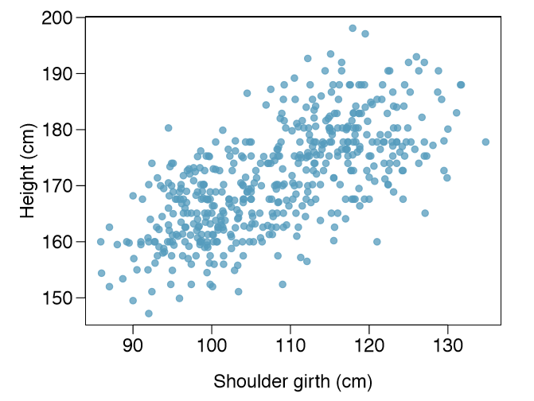
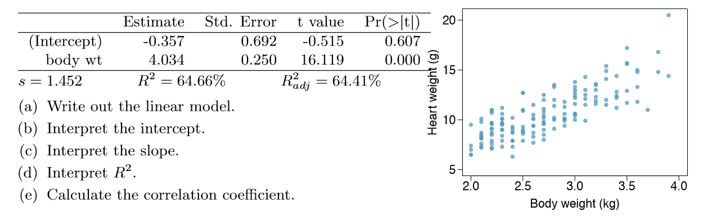
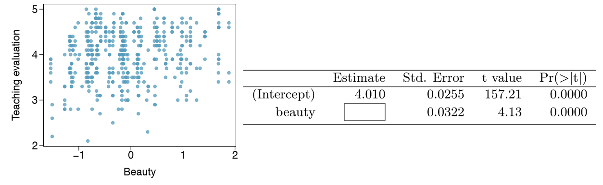
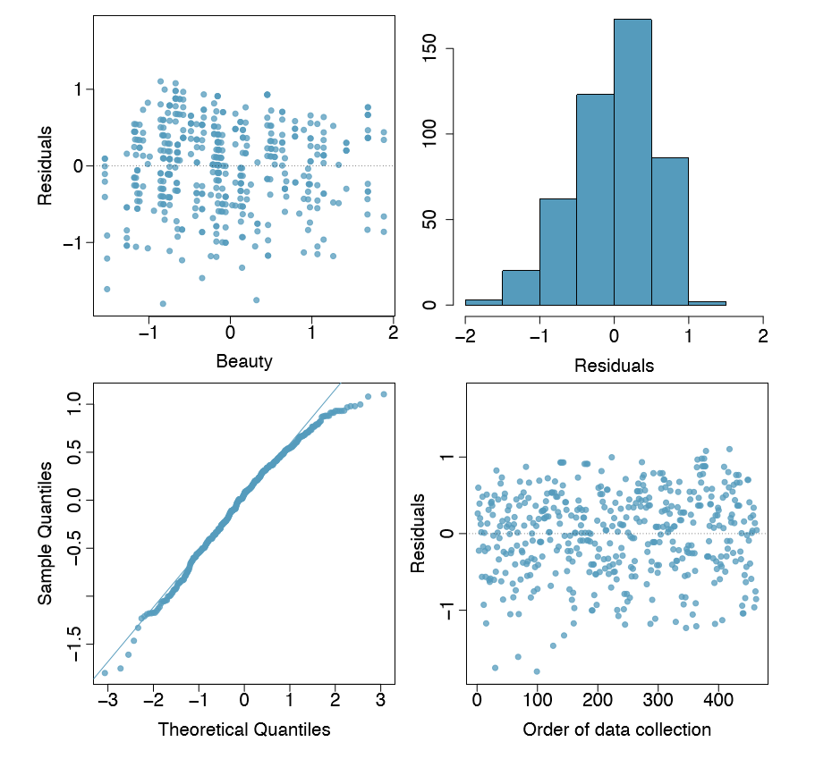

##Graded Questions

Q:1 (7.24) Nutrition at Starbucks, Part I. The scatterplot below shows the relationship between the number of calories and amount of carbohydrates (in grams) Starbucks food menu items contain. Since Starbucks only lists the number of calories on the display items, we are interested in predicting the amount of carbs a menu item has based on its calorie content.



(a) Describe the relationship between number of calories and amount of carbohydrates (in grams) that Starbucks food menu items contain. 
(b) In this scenario, what are the explanatory and response variables? 
(c) Why might we want to fit a regression line to these data? 
(d) Do these data meet the conditions required for fitting a least squares line?

**_A: (a) The scatter plot supports a hypothesis as calorie content increases the amount of carbohydrates (in grams) also increases. There appears to be a positive linear relationship between calorie content and amount of carbohydrates (in grams), but the relationship is not perfect. The scatter plot exhibits some `trend`, but it also exhibits some `scatter`. Therefore, it is a statistical relationship, not a deterministic one._**

**_(b) Variable `x`, is regarded as the predictor, explanatory, or independent variable. It would be `Calorie Content`._**

**_Variable `y`, is regarded as the response, outcome, or dependent variable. It would be `amount of carbohydrates (in grams)`._**

**_(c) As Starbucks only lists calorie content on the display items. For consumers who have diabetes or on strict diet, it would be helpful in predicting number of carbs a menu item has based on its calorie content._**

**_(d) The scatter plot supports linear relationship, but residuals plot actually shows a nonlinear relationship. Outliers can be clearly noticed, and the residuals show an increase and decrease patterns, the points may not have constant variance. Hence data does not meet the conditions required for fitting a least squares line._**


Q:2 (7.26) Body measurements, Part III. Exercise 7.15 introduces data on shoulder girth and height of a group of individuals. The mean shoulder girth is 107.20 cm with a standard deviation of 10.37 cm. The mean height is 171.14 cm with a standard deviation of 9.41 cm. The correlation between height and shoulder girth is 0.67.



(a) Write the equation of the regression line for predicting height. 
(b) Interpret the slope and the intercept in this context. 
(c) Calculate $R^2$ of the regression line for predicting height from shoulder girth, and interpret it in the context of the application. 
(d) A randomly selected student from your class has a shoulder girth of 100 cm. Predict the height of this student using the model. 
(e) The student from part (d) is 160 cm tall. Calculate the residual, and explain what this residual means. 
(f) A one year old has a shoulder girth of 56 cm. Would it be appropriate to use this linear model to predict the height of this child?

**_A: From given data, explanatory variable `x` is `shoulder girth` and response variable `y` is `height`._**

**_(a) Equation of regression line for predicting height $\hat{y}_h = {\beta}_0 + {{\beta}_1}x$_**

**_where ${\beta}_0, {\beta}_1$ are linear regression parameters._**

**_Using the data, mean shoulder girth $\bar{x} = 107.20 cm$, standard deviation of shoulder girth ${s}_x = 10.37 cm$, mean height $\bar{y} = 171.14 cm$, standard deviation of height ${s}_y = 9.41 cm$, correlation between height and shoulder girth $R = 0.67$._**

```{r, echo=T}
sx <- 10.37
sy <- 9.41
r <- 0.67
b1 <- (sy/sx) * r

x.bar <- 107.20
y.bar <- 171.14

b0 <- -1 * (x.bar * b1) +  y.bar

rsq <- r^2
x100 <- 100
y100 <- b0 + b1 * 100

oby <- 160
resy <- oby - round(y100,2)
```

**_${\beta}_1 = {\frac {s_y} {s_x}} * R = {\frac {9.41} {10.37}} * 0.67 = `r b1`$_**

**_Applying the point-slope equation using (107.20, 171.14) and the slope ${\beta}_1 = `r b1`$_**

**_$(y - \bar{y}) = {\beta}_1(x - \bar{x}) = (y - 171.14) = `r b1`(x - 107.20)$_**

**_Simplifing the equation, regression line for predicting height is $y = `r b0` + `r b1`x$._**

**_(b) The slope and intercept estimates for the given data are ${\beta}_1 = `r b1`$ and ${\beta}_1=0 = `r b0`$._**

**_Estimate slope ${\beta}_1$, translate to, for every one-centimeter increase in shoulder girth $x$, the height of the individual $y$ will be increased by `r b1`. Also, for every one-centimeter decrease in shoulder girth $x$, the height of the individual $y$ will be decreased by `r b1`. Whereas intercept ${\beta}_0$ means the height of the individual, with shoulder girth `zero` will be equal to `r b0`. One must be cautious in this interpretation, while there is a real association, we cannot interpret a causal connection between the variables because these data are observational. That is, individual of height `r b0` cannot have shoulder girth as `zero` cm._**

**_(c) $R^2 = `r rsq`$, in our case `r rsq*100` percent of variation in data can be explained by linear model._**

**_(d) Shoulder girth $x = 100 cm$, regression line for predicting height is $y = `r b0` + `r b1`x$_**

**_Subsituting the vaues $y = `r b0` + `r b1`*100 = `r y100`$. For an individual with shoulder girth of 100 cm, predicted height is `r round(y100,2)` cm. _**

**_(e) Residual is difference between observed and expected, observed height of an individual with shoulder girth of 100 cm is 160 cm and model predicted height is `r round(y100,2)` cm._**

**_Residual ${e}_x = {y}_x - \hat{y}_x = 160 - `r round(y100,2)` = `r round(resy,2)`$_**

**_Residual of `r round(resy,2)` means model overestimated the height of the individual._**

**_(f) While there is a real association, we cannot interpret a causal connection between the variables because these data are observational. Lowest shoulder girth data shown on scatter plot is approximately 85 cm. Shoulder girth of 56 cm does not fall in sample data. However, the equation can be used for a general estimate, but caution must be observed while interpreting the estimate. Applying a model estimate to values outside of the realm of the original data is called extrapolation. If we extrapolate, we are making an unreliable bet that the approximate linear relationship will be valid in places where it has not been analyzed._**

Q:3 (7.30) Cats, Part I. The following regression output is for predicting the heart weight (in g) of cats from their body weight (in kg). The coefficients are estimated using a dataset of 144 domestic cats.



**_A: (a) Using the data, ${\beta}_0 = -0.357$, ${\beta}_1 = 4.034$, Linear model: $\hat{y}_h = {\beta}_0 + {{\beta}_1}x = \hat{y}_h = -0.357 + 4.034x$._**

**_(b) Intercept, ${\beta}_0 = -0.357$, translates to cat with body weight of `zero` kg will have heart weight of -0.357 g. This cannot be true as weight cannot exist in negative numbers. As this observational data, caution must be observed while using model in the places it has not been analyzed._**

**_(c) Slope, ${\beta}_1 = 4.034$, for every one kg of increase in cat's body weight, heart weight will be increased by 4.034 times. And the opposite is also true, for every one kg of a decrease in cat's body weight, heart weight will be decreased by 4.034 times. Caution must be observed while interpreting the estimate. If we extrapolate, we are making an unreliable bet that the approximate linear relationship will be valid in places where it has not been analyzed._**

**_(d) $R^2 = 64.66\%$, it means 64.66 percent of observed data can be explained using liner model: $\hat{y}_h = -0.357 + 4.034x$._**

**_(e) Since given value for $R^2$ is in percentage, it needs to be divided by 100. $R^2 = 64.66/100 = `r 64.66/100`$, Correlation coefficient $R=\sqrt(R^2) = \sqrt(`r 64.66/100`) = `r sqrt(64.66/100)`$ _**

Q4: (7.40) Rate my professor. Many college courses conclude by giving students the opportunity to evaluate the course and the instructor anonymously. However, the use of these student evaluations as an indicator of course quality and teaching effectiveness is often criticized because these measures may reflect the influence of non-teaching related characteristics, such as the physical appearance of the instructor. Researchers at University of Texas, Austin collected data on teaching evaluation score (higher score means better) and standardized beauty score (a score of 0 means average, negative score means below average, and a positive score means above average) for a sample of 463 professors. The scatterplot below shows the relationship between these variables, and also provided is a regression output for predicting teaching evaluation score from beauty score.



(a) Given that the average standardized beauty score is -0.0883 and average teaching evaluation score is 3.9983, calculate the slope. Alternatively, the slope may be computed using just the information provided in the model summary table. 
(b) Do these data provide convincing evidence that the slope of the relationship between teaching evaluation and beauty is positive? Explain your reasoning. 
(c) List the conditions required for linear regression and check if each one is satisfied for this model based on the following diagnostic plots.



```{r, echo=T}
x <- -0.0883
y <- 3.9983
b0 <- 4.010

b1 <- (y - b0)/x

```

**_A: (a) From the given data, standardized beauty score is explanatory variable $x = -0.0883$, teaching evaluation score is response variable $y = 3.9983$. Incercept ${\beta}_0 = 4.010$, using linear model: $\hat{y}_h = {\beta}_0 + {{\beta}_1}x$_**

**_$3.9983 = 4.010 + {{\beta}_1}*(-0.0883)$, solving the equation slope ${\beta}_1 = `r b1`$_**

**_(b) By visual analysis of scatter plot exhibits `scatter`. It does not show any upward or downward trend. Also, `p` is shown as `zero` in summary table. It can be read as accepting the null hypothesis; there is no relation between teaching evaluation and beauty. Therefore, there is no convincing evidence of relationship between teaching evaluation and beauty._**

**_(c) Conditions required for linear regression are_**

**_1. Looking at scatterplot, residuals are randomly scattered around zero on the horizontal axis. This indicates `Linearity` condition is met._**

**_2. Histogram suggests data is left skewed. This indicates there are some outliers. Normal probability plot shows that all data points are not on the line, but they are close to the line. Both graphs show enough evidence that data meets `Nearly Normal` condition._**

**_3. Looking at scatterplot, the points have constant variance, with the residuals scattered randomly around zero on the horizontal axis. Since residuals do not show increasing or decreasing pattern, we can assume `Constant Variance` exists._**

**_4. Since this is not time series data, it can be assumed independence exists. Order of data collection plot shows data points are randomly scattered._**

